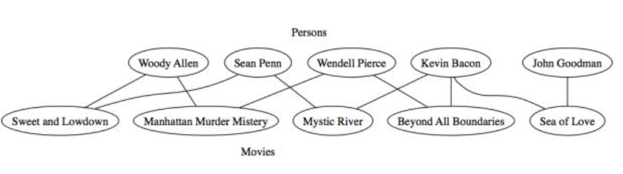
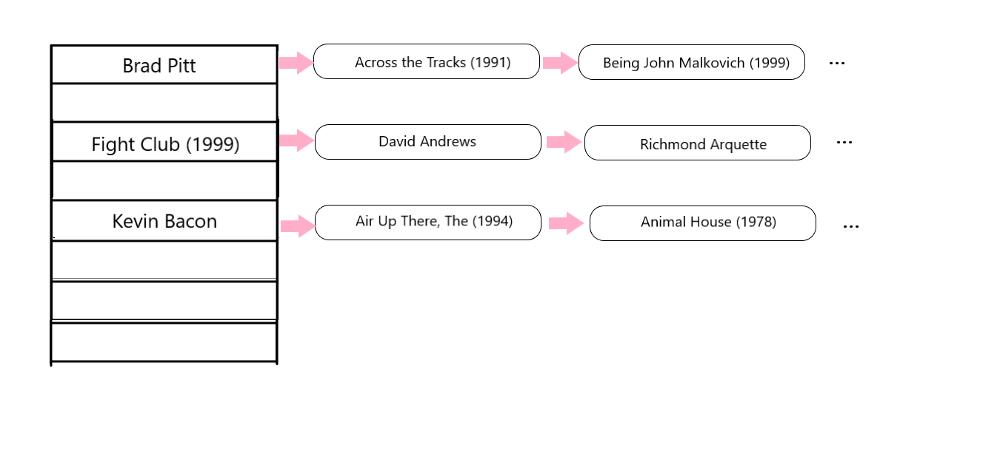
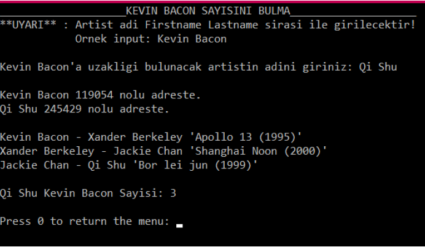

# The Oracle of Bacon
This is my project for Algorithm Analysis class. The aim of this project is finding distance between artists using graph and hash data structures in C language.

### Functions of This Program
1. Make a graph data structure which include artists and movies.
2. Find distance between an artist and Kevin Bacon. This number will be Bacon number.
3. Find distance between two artist which user selected.
4. Show connections of an artist or movie.

#### Example Connections Between Artists

#### The Data Structure that I Used

In this image movie names showed as string for clarity. In real data structure, array consists of artists and movies names. Their address of in array is their generated hash number with Double Hashing Method. Connections of movies or artists kept in linked list. Connected elements specified with their integer hash numbers not with their names.

#### Example Output for Program
This output shows connection between Kevin Bacon and Qi Shu. Bacon number is 3.

